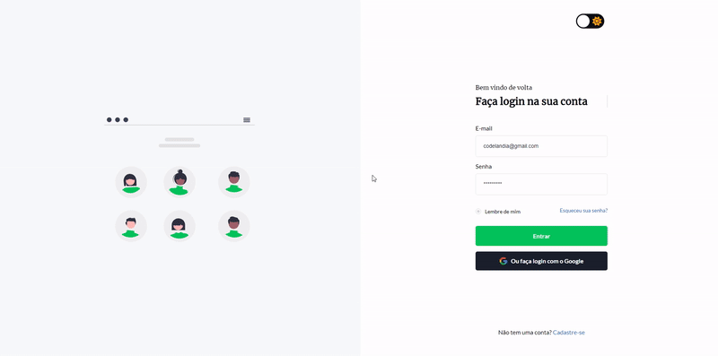

## Desafio #4: Projeto Login

### • [Link do desafio no Figma](https://www.figma.com/file/Yb9IBH56g7T1hdIyZ3BMNO/Desafios---Codel%C3%A2ndia?type=design&node-id=4261-2&mode=design&t=F8sJFIP7BJ0EQtPg-0) 

### • [Deploy](https://geovanaborba.github.io/Codelandia-desafios/Desafio-4/) 

 

### Alterações após finalizar o layout proposto:

* Adicionado botão para dark mode

* Input radio personalizado

* Efeitos de cores nos botões e links através do :hover para os dois temas

* Required aplicado aos inputs

* Animação de máquina de escrever ao título principal usando CSS

### Resultado: 

### Tutoriais de referência:  

• [Acervo Lima - Efeito máquina de escrever](https://acervolima.com/como-criar-animacao-de-maquina-de-escrever-usando-html-e-css/)

• [Blog Soares Dev - Radio button personalizado com CSS](https://blog.soaresdev.com/radio-button-personalizado-com-css/)

• [Canal Jovem Programador - Alternar tema com CSS e JS](https://www.youtube.com/watch?v=SBq-kXXn1PQ&list=PLKEvIBJ0GJUUp3NQ9BPSrGisHaFmEL4u9&index=15&t=1s)

 

### ♥ Página desenvolvida por [Geovana Borba](https://www.linkedin.com/in/geovanaborba/)

### • Desafio e layout criados por [Iuri Silva](https://www.linkedin.com/in/iuricode/?originalSubdomain=br)

### • Comunidade do Discord [Codelândia](https://discord.gg/79qyJwdsGk)