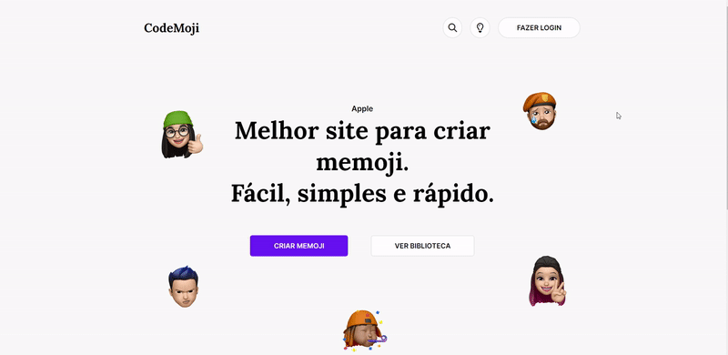

## Desafio #8: CodeMoji

### • [Link do desafio no Figma](https://www.figma.com/file/Yb9IBH56g7T1hdIyZ3BMNO/Desafios---Codel%C3%A2ndia?type=design&node-id=157277-3228&mode=design&t=VRAOw7mZJo1FVQnt-0) 

### • [Deploy](https://geovanaborba.github.io/Codelandia-desafios/Desafio-8/) 

 

### Alterações após finalizar o layout proposto:

* Responsividade

### Resultado: 

 

### Tutoriais de referência: 

 

### ♥ Página desenvolvida por [Geovana Borba](https://www.linkedin.com/in/geovanaborba/)

### • Desafio e layout criados por [Iuri Silva](https://www.linkedin.com/in/iuricode/?originalSubdomain=br)

### • Comunidade do Discord [Codelândia](https://discord.gg/79qyJwdsGk)