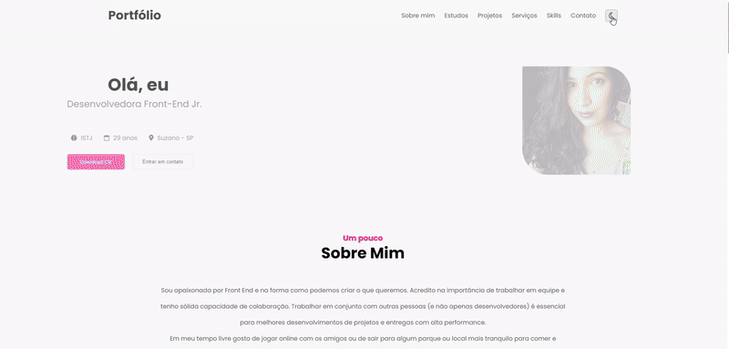

## Desafio #9: Portfólio

*Foi proposto um layout no Figma, mas decidi fazer algumas alterações e finalizar do meu jeito. Foram acrescentadas algumas ferramentas para melhor funcionamento do site. Futuramente, quero refazer esse projeto utilizando React e aprimorando o design geral.*

### • [Link do desafio no Figma](https://www.figma.com/file/Yb9IBH56g7T1hdIyZ3BMNO/Desafios---Codel%C3%A2ndia?type=design&node-id=13190-2&mode=design&t=LO6De36FxHllsujU-0) 

### • [Deploy](https://geovanaborba.github.io/Codelandia-desafios/Desafio-9/) 

 

  

 

### ⚙️ Ferramentas:

* Font Awesome 

    *ícones e animações*.

 

* Form Submit 

    *API para envio de formulário, sem necessidade de um código back-end*.

 

* Scroll Reveal JS 

    *Biblioteca para animação de rolagem da página*.

 

* OWL Carousel 

    *Plugin JQuery para criação de carrosséis*.

 

 

### 💻 Resultado

  

### 🌙 Dark Mode

  

### 📱 Responsivo (em andamento)

 

 

### ♥ Página desenvolvida por [Geovana Borba](https://www.linkedin.com/in/geovanaborba/)

### • Comunidade do Discord [Codelândia](https://discord.gg/79qyJwdsGk)